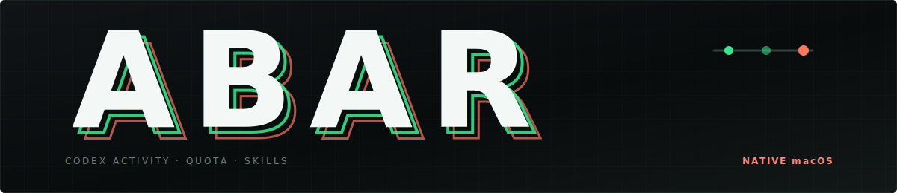
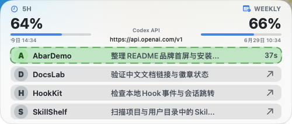
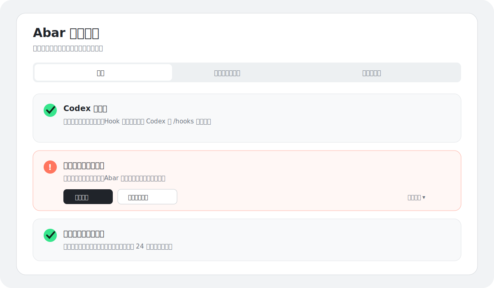
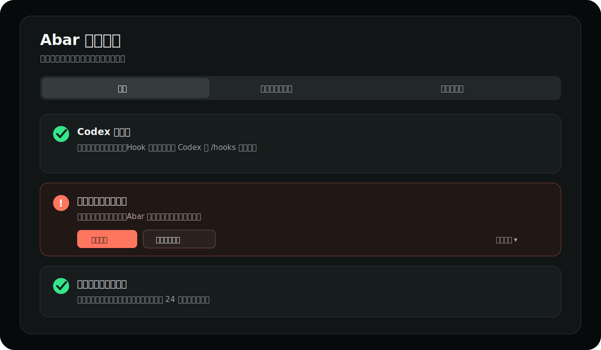

<p align="center">
  
</p>

# Abar

> 一个专为 OpenAI Codex 设计的原生 macOS 顶部悬浮监视器。

<p align="center">
  <a href="https://github.com/lanewulll/Abar/actions/workflows/ci.yml"></a>
  <a href="#系统要求"></a>
  <a href="#系统要求"></a>
  <a href="#开发"></a>
  <a href="https://openai.com/codex/"></a>
  <a href="LICENSE"></a>
  <a href="#快速开始"></a>
</p>

Abar 常驻屏幕顶部与菜单栏，把 Codex 的额度、任务活动和连接来源放在一个随时可见的原生面板里。悬停即可展开，任务完成后保留当日记录，点击任务还能尝试跳回对应的 Codex 会话。

它由 Swift、SwiftUI 与 AppKit 构建，不依赖 Electron；Hook 事件和快照保存在本地 SQLite 中，事件服务只监听 `127.0.0.1`。这是一个面向源码构建的早期项目：当前不提供签名、公证的二进制 Release。

| 能力 | Abar 如何工作 |
| --- | --- |
| **原生顶部悬浮** | 使用无边框 `NSPanel` 常驻屏幕顶部，收起时保持轻量，悬停后展开完整面板。 |
| **额度一览** | 展示 Codex 5 小时与每周窗口的使用比例、剩余额度和重置时间。 |
| **任务追踪** | 通过 `UserPromptSubmit` 与 `Stop` Hook 显示运行中任务和当日最近完成记录。 |
| **跳回会话** | 点击已完成任务时优先打开 `codex://threads/...`，失败时回退到激活 Codex。 |
| **本地隐私** | Reporter 只连接本机；敏感字段写入数据库前会被清理，不持久化认证令牌。 |
| **源码安装** | 提供环境检查、构建、安装、诊断和卸载脚本，无需 `sudo`。 |

<p align="center">
  
</p>

<p align="center"><sub>真实应用界面；截图仅使用虚构任务、虚构路径和公开 API 地址。</sub></p>

## 快速开始

### 系统要求

- Apple Silicon Mac（M1 或更新机型）
- macOS 14 Sonoma 或更高版本
- Node.js 20 或更高版本
- Swift 6 / Xcode Command Line Tools
- Git 与 npm
- 已安装 OpenAI Codex CLI，并已通过 `codex login` 登录

目前不支持 Intel Mac。

### 1. 克隆并安装

```bash
git clone https://github.com/lanewulll/Abar.git
cd Abar
npm run setup
```

`npm run setup` 会检查 macOS、芯片、Node、Swift、Git、Codex CLI 与登录状态，使用 `npm ci` 安装依赖，构建应用、安装到 `~/Applications/Abar.app`、启动并等待本地健康接口，全程不需要 `sudo`。它不会静默修改 Codex Hook。

如果自动 setup 失败，可保留并使用手动 fallback：

```bash
npm ci
npm run build
npm run install:app
open "$HOME/Applications/Abar.app"
```

### 2. 配置 Codex Hook

先预览将要生成的完整配置：

```bash
npm run hooks:preview
```

确认后执行安全合并：

```bash
npm run hooks:install
```

安装器会读取现有 `~/.codex/hooks.json`、创建带时间戳的备份、结构化合并 Abar 的 `UserPromptSubmit` 与 `Stop` Hook，并重新校验 JSON；不会覆盖其他 Hook。随后必须在 Codex 中输入 `/hooks`，人工检查并信任 Abar Hook。信任动作不能由 Abar 或 Codex 静默代替用户完成。

### 3. 验证连接

先运行：

```bash
npm run doctor
```

再在 Codex 中新建一个任务，悬停屏幕顶部的 Abar 面板；或直接检查健康接口：

```bash
curl http://127.0.0.1:3987/health
```

正常响应：

```json
{"ok":true,"service":"abar"}
```

## Hook 配置

新 Hook 指向 `~/Applications/Abar.app/Contents/Resources/reporter/reporter.js`，因此移动源码仓库不会再破坏 Reporter。旧版 Hook 如果仍指向源码目录，运行 `npm run hooks:install` 可迁移到稳定路径。Abar 只会自动管理带 `ABAR_HOOK_OWNER=abar-v1` 标记的 Hook；无法确认归属的旧条目不会在卸载时自动删除。

<details>
<summary><strong>查看 Hook 配置结构</strong></summary>

```json
{
  "hooks": {
    "UserPromptSubmit": [
      {
        "hooks": [
          {
            "type": "command",
            "command": "ABAR_HOOK_OWNER=abar-v1 ABAR_SERVER_PORT=3987 node '/Users/your-name/Applications/Abar.app/Contents/Resources/reporter/reporter.js'",
            "timeout": 2
          }
        ]
      }
    ],
    "Stop": [
      {
        "hooks": [
          {
            "type": "command",
            "command": "ABAR_HOOK_OWNER=abar-v1 ABAR_SERVER_PORT=3987 node '/Users/your-name/Applications/Abar.app/Contents/Resources/reporter/reporter.js'",
            "timeout": 2
          }
        ]
      }
    ]
  }
}
```

实际绝对路径以 `npm run hooks:preview` 输出为准。

</details>

## 工作原理

1. Codex 在提交提示词和任务停止时执行本地 Reporter。
2. Reporter 从标准输入读取 Hook JSON，并以非阻塞方式发送到 `127.0.0.1`。
3. Abar 只提取任务追踪所需的短标题、项目路径、session/turn 标识、事件类型与连接模式，并将额度和 Skill 快照写入本地 SQLite。
4. 原生面板读取快照，推导任务状态、菜单栏信号和会话跳转目标。

Reporter 在 Abar 未运行、请求超时或输入无效时仍以成功状态退出，监控功能不会阻塞 Codex。

## 状态中心

右键菜单栏 Abar 图标并选择 **打开状态中心…**，可查看：

- **状态**：Codex、Hook、Reporter、本地服务、端口、数据库与额度状态
- **隐私与本地数据**：数据库、日志、缓存和 Hook 路径，删除数据与两种卸载入口
- **诊断与关于**：脱敏诊断报告、当前版本和 GitHub 更新检查

普通用户只会先看到“发生了什么、是否还能继续使用、下一步按钮”；HTTP 状态、endpoint、绝对路径、端口占用与命令输出放在技术详情和诊断报告中。

状态中心视觉原型：

<p align="center">
  
  
</p>

## 配置

| 环境变量 | 默认值 | 说明 |
| --- | --- | --- |
| `ABAR_SERVER_PORT` | `3987` | Abar 与 Reporter 共用的本地端口 |
| `ABAR_REPORTER_TIMEOUT_MS` | `800` | Reporter 请求超时，单位为毫秒 |
| `ABAR_REPORTER_DEBUG` | 未启用 | 设为 `1` 时记录轻量连接错误 |
| `ABAR_NATIVE_DB_PATH` | 应用数据目录 | 覆盖 SQLite 路径，主要用于开发和测试 |
| `ABAR_INSTALL_DIR` | `~/Applications` | 覆盖本地安装目录 |
| `CODEX_HOME` | `~/.codex` | Codex 配置和文件型认证目录 |

<details>
<summary><strong>自定义端口、调试日志与更新卸载</strong></summary>

应用与 Hook 必须使用相同端口：

```bash
ABAR_SERVER_PORT=4567 "$HOME/Applications/Abar.app/Contents/MacOS/AbarNativeOverlay"
ABAR_SERVER_PORT=4567 npm run hooks:install
```

在 Hook 命令开头添加调试变量：

```text
ABAR_REPORTER_DEBUG=1 ABAR_SERVER_PORT=3987 node '/绝对路径/reporter.js'
```

日志位于：

```text
~/Library/Logs/Abar/codex-hook-reporter.log
```

仅检查更新：

```bash
npm run update:check
```

源码更新仍由用户明确执行，Abar 不会自动覆盖本地修改：

```bash
git pull --ff-only
npm run setup
npm run hooks:preview
npm run doctor
```

仅移除 App、保留数据和 Hook：

```bash
npm run uninstall:app
```

完整卸载先预览，再执行：

```bash
npm run uninstall:full -- --dry-run
npm run uninstall:full -- --yes
```

</details>

## 数据与隐私

本地数据库位于：

```text
~/Library/Application Support/abar/abar.sqlite
```

Reporter 只向 `127.0.0.1` 发送 Hook 事件。Abar 不保存完整 prompt、transcript path 或完整 Hook payload，只保存：

- 最多 15 个字符的任务短标题
- 项目路径
- session ID、turn ID、事件类型和状态
- Codex 连接模式；API 模式下可能保存公开 base URL
- Skill 名称、描述和路径
- 整理后的额度比例、重置时间和错误类别

事件与额度记录使用滚动 24 小时保留策略。升级旧数据库时，Abar 会在迁移期间创建临时备份，成功后清理备份，并删除旧记录中的完整 prompt、transcript path 和额度原始响应。

额度功能仅在 Codex 使用文件型凭据时读取 `$CODEX_HOME/auth.json` 或 `~/.codex/auth.json`，并请求：

```text
https://chatgpt.com/backend-api/wham/usage
```

Abar 会在内存中将访问令牌用于该次请求，但不会将访问令牌、刷新令牌、Cookie、Authorization Header、API Key、密码或 secret 写入日志、诊断报告或数据库。若 Codex 把凭据存入 macOS Keychain 而不是 `auth.json`，任务追踪仍可用，但额度功能会显示不可用。

更新检查默认每天访问一次 GitHub API，可在状态中心关闭；Abar 不上传任务、项目路径、数据库或遥测。

> `wham/usage` 是 ChatGPT 的内部接口，不是稳定的公开 API，可能随时变化。官方额度页面是 <https://chatgpt.com/codex/settings/usage>。

## 故障排查

先运行自动诊断：

```bash
npm run doctor
```

诊断命令会输出 `healthy`、`degraded` 或 `broken`，并检查系统工具、Codex CLI、`codex login status`、Hook JSON、Abar 所有权标记、Reporter 路径、端口、健康接口、数据库和额度快照。Hook 是否已信任只能标记为 unknown，并提示用户在 `/hooks` 中确认。

复制脱敏 JSON 报告：

```bash
npm run diagnostic -- --json
```

报告会把用户主目录替换为 `~`，且不包含令牌、Cookie、Authorization Header、完整 prompt 或私有 Hook payload。

<details>
<summary><strong>面板没有任务</strong></summary>

- 确认 Abar 正在运行：`open ~/Applications/Abar.app`
- 在 Codex 中执行 `/hooks`，确认 Hook 已启用并信任
- 运行 `npm run hooks:install`，确认 Hook 已迁移到安装后的稳定 Reporter
- 使用健康接口确认本地服务正在运行

</details>

<details>
<summary><strong>端口被占用</strong></summary>

```bash
lsof -nP -iTCP:3987 -sTCP:LISTEN
```

退出占用端口的程序，或为 Abar 与 Hook 同时配置另一个端口。Abar 启动日志会记录 `server bind failed`。

</details>

<details>
<summary><strong>看不到额度</strong></summary>

- 确认 Codex 已登录
- 运行 `codex login status` 检查真实登录状态
- 若 Codex 使用 Keychain 存储凭据，Abar 目前无法直接读取额度，但任务追踪仍可使用
- 网络、代理、令牌失效、限流或内部接口变化都可能导致刷新失败
- Abar 会在面板中显示最近一次额度刷新错误

</details>

<details>
<summary><strong>macOS 阻止打开</strong></summary>

本地构建使用 ad-hoc 签名，没有 Apple Developer ID 签名，也未经过公证。通过本仓库源码执行 `npm run setup` 后，脚本会清理本地隔离属性；不要运行来源不明的 Abar 二进制文件。

</details>

## 开发

```bash
npm install
npm test
npm run dev
```

构建 release 应用：

```bash
npm run build
```

产物位于 `native-overlay/dist/Abar.app`。

```text
native-overlay/               Swift 核心、macOS 应用与测试
reporters/codex-hook-reporter Codex Hook Reporter
scripts/                      环境检查、安装、诊断与卸载
docs/images/                  README 与应用图像资源
.github/                      CI 和协作模板
```

## 已知限制

- 只支持 Codex，不支持 Claude、Cursor、Ollama 或多 Agent 聚合
- 只支持 Apple Silicon 和 macOS 14 以上版本
- 当前不提供自动启动、自动拉取源码、DMG、Developer ID 签名或公证；只提供每日轻量更新检查
- 额度依赖未公开的 ChatGPT 内部接口

## 给 Codex 的一句话安装指令

将下面整段直接复制给 Codex：

> 请检查这台 Mac 是否满足 Abar 的环境要求，然后克隆 `https://github.com/lanewulll/Abar.git`，运行 `npm run setup`、`npm run hooks:install` 和 `npm run doctor` 完成安装与验证；不要覆盖已有的 `hooks.json`，修改前先备份并安全合并，遇到 Codex 登录、`/hooks` 信任、macOS 安全提示或权限确认时暂停让我操作，最后告诉我安装结果和启动方式。

## 参与贡献

提交 Issue 或 Pull Request 前请阅读 [CONTRIBUTING.md](CONTRIBUTING.md)。安全问题请按照 [SECURITY.md](SECURITY.md) 私下报告。

## 许可证

Abar 使用 [MIT License](LICENSE)。
